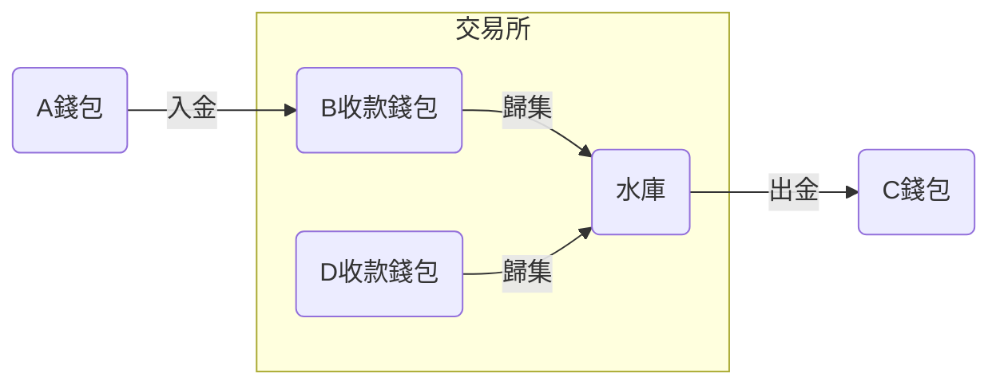

# CEX (中心化交易所)

交易序號 = hash = TxID

```mermaid
flowchart LR
    subgraph s1["交易所"]
        B("B收款錢包")
        B -- 歸集 --> C("水庫")
        D("D收款錢包") -- 歸集 --> C
    end
    A("A錢包") -- 入金 --> B
    C -- 出金 --> E("C錢包")
```

# 智能合約 (smart contracts)

垃圾幣

# 虛擬通貨市價

均價算法 = (高點加低點) / 2

# BTC (比特幣)
為求點對點的支付方式(point to point)

## 支付架構 UTXO
